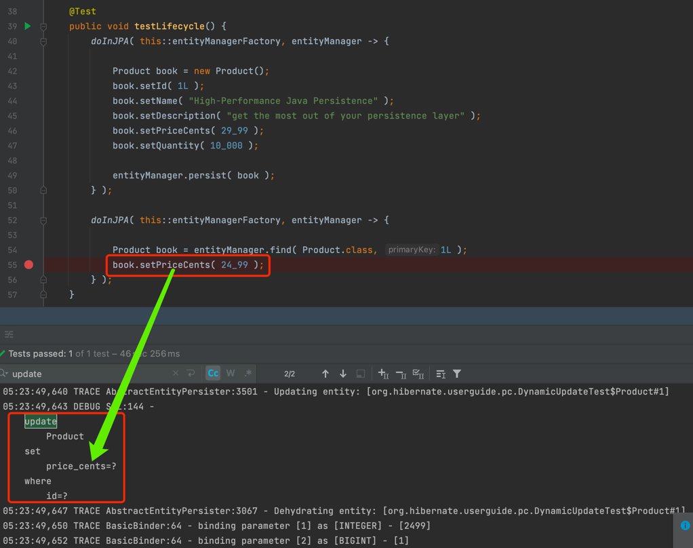
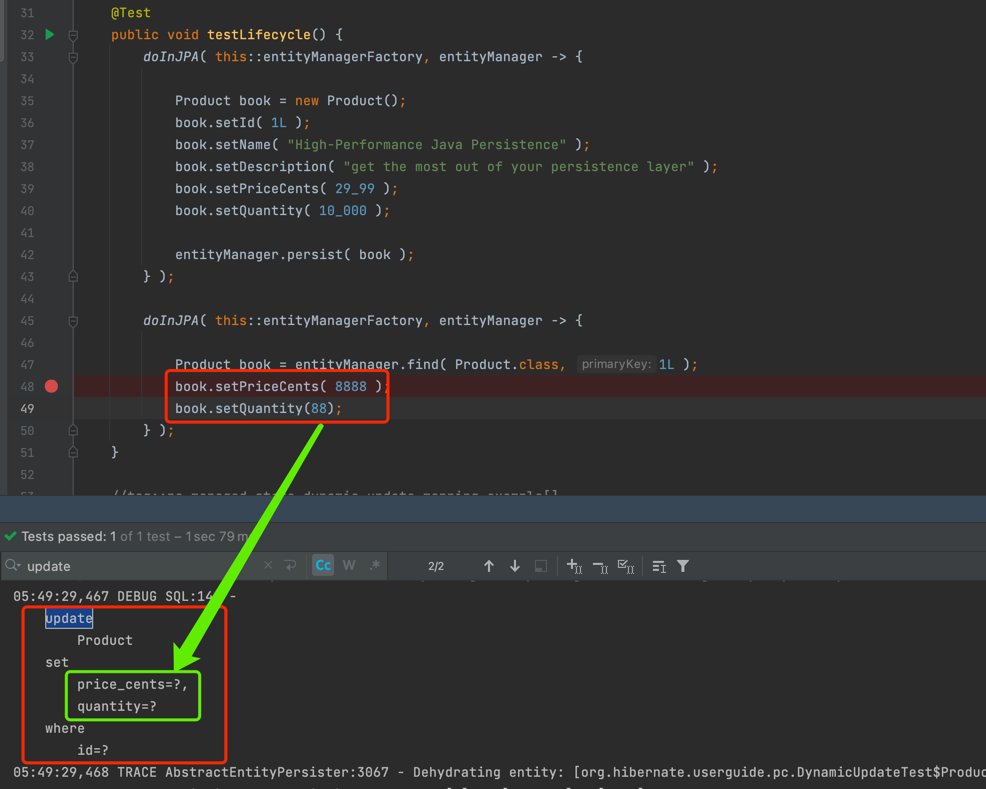

## 使用@DynamicUpdate完成动态更新

[hibernate github仓库地址](https://github.com/hibernate)

[相关代码仓库](https://github.com/hibernate/hibernate-orm/tree/e76241a3091078713dd4b57de085f5fadce5e0db/hibernate-core/src/test/java/org/hibernate/test/bytecode/enhancement/lazy/proxy/inlinedirtychecking/dynamicupdate) 

###克隆hibernate代码后全局搜索"DynamicUpdate"

###找到该文件 Annotations.adoc (以下内容是有关DynamicUpdate的相关说明)
```xml
[[annotations-hibernate-dynamicupdate]]
==== `@DynamicUpdate`

The https://docs.jboss.org/hibernate/orm/{majorMinorVersion}/javadocs/org/hibernate/annotations/DynamicUpdate.html
[`@DynamicUpdate`] annotation is used to specify that the `UPDATE` SQL statement 
、should be generated whenever an entity is modified.

By default, Hibernate uses a cached `UPDATE` statement that sets all table columns.
When the entity is annotated with the `@DynamicUpdate` annotation, 
、the `PreparedStatement` is going to include only the columns whose values have been changed.

See the <<chapters/pc/PersistenceContext.adoc#pc-managed-state-dynamic-update,`@DynamicUpdate`>> section for more info.
```

###之后在定位到"PersistenceContext.adoc" 在该文件搜索"pc-managed-state-dynamic-update"
```xml
[[pc-managed-state-dynamic-update]]
==== Dynamic updates

To enable dynamic updates, you need to annotate the entity with the `@DynamicUpdate` annotation:

[[pc-managed-state-dynamic-update-mapping-example]]
.`Product` entity mapping
====
[source, JAVA, indent=0]
----
include::{sourcedir}/DynamicUpdateTest.java[tags=pc-managed-state-dynamic-update-mapping-example]
----
====

This time, when rerunning the previous test case, Hibernate generates the following SQL UPDATE statement:

[[pc-managed-state-dynamic-update-example]]
.Modifying the `Product` entity with a dynamic update
====
[source, SQL, indent=0]
----
include::{extrasdir}/pc-managed-state-dynamic-update-example.sql[]
----
```

###接着找到"DynamicUpdateTest.java"

```java
@Test
	public void testLifecycle() {
		doInJPA( this::entityManagerFactory, entityManager -> {

			Product book = new Product();
			book.setId( 1L );
			book.setName( "High-Performance Java Persistence" );
			book.setDescription( "get the most out of your persistence layer" );
			book.setPriceCents( 29_99 );
			book.setQuantity( 10_000 );

			entityManager.persist( book );
		} );

		doInJPA( this::entityManagerFactory, entityManager -> {

			Product book = entityManager.find( Product.class, 1L );
			book.setPriceCents( 24_99 );
		} );
	}
```

> 代码解析

1 存储数据

    "entityManager.persist( book );"

2 查询刚刚所存到对象

    Product book = entityManager.find( Product.class, 1L );

3 更改属性(触发更新操作)

    book.setPriceCents( 24_99 );

> 控制台日子输出


    


